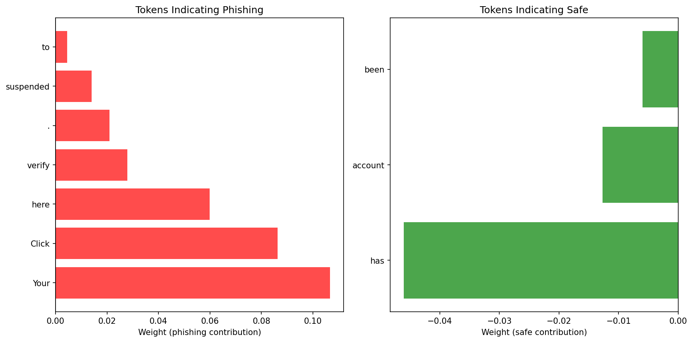
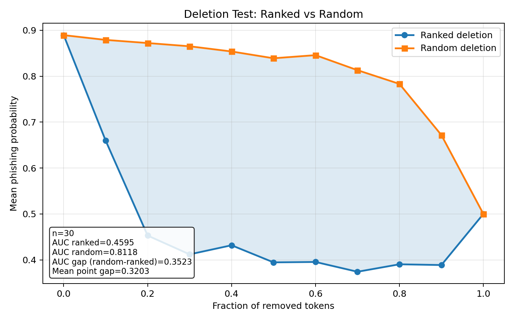

# Explaining phishing email detection with LIME and DistilRoBERTa

**Team:** Kirill Greshnov | Vladimir Paskal

**Course:** [S26] Explainable, Interpretable, and Fair AI @ Innopolis University

**Date:** April 2026

---

## Domain of application

**Cybersecurity: phishing email detection**

In this study, we train a `distilroberta-base` classifier for phishing email detection and use **LIME** to explain single predictions.

The task is binary classification:

| Label | Meaning        |
| ----- | -------------- |
| `1`   | phishing email |
| `0`   | safe email     |

The repository now contains two ways to reproduce the work: Python scripts for the saved local artifacts and a standalone Google Colab notebook that downloads the dataset and runs the full mini-pipeline in one place.

The main pipeline is:

1. Load and clean the email dataset.
2. Split it into train, validation, and test sets.
3. Fine-tune DistilRoBERTa for binary classification.
4. Use LIME to explain individual emails.
5. Check explanations with a deletion test.

## Motivation

Phishing detection is a good use case for explainable AI. In a security system, it is not enough to say that an email is phishing. Analysts also need to see which words or phrases made the model suspicious.

False negatives can let malicious emails reach users. False positives can block legitimate communication. Explanations help analysts decide whether the model is relying on meaningful evidence such as credential requests, urgency, links, and account-threat wording, or on accidental dataset artifacts.

## Importance in real-world applications

A phishing detector that only returns a probability is hard to audit. If the model flags an email as phishing, the analyst needs evidence that can be inspected quickly:

- Which tokens pushed the email toward phishing?
- Which tokens pushed it toward safe?
- Would the prediction change if the most suspicious tokens were removed?

This is why local explanations are useful: they connect a single alert to specific text evidence.

## Dataset

The source dataset contains **18,650 rows**. After dropping rows with blank email text, the implemented pipeline uses **18,631 emails**:

| Class          |  Count |
| -------------- | -----: |
| Safe email     | 11,322 |
| Phishing email |  7,309 |

The split was stratified, so each split keeps almost the same class ratio:

| Split      |   Rows |  Safe | Phishing |
| ---------- | -----: | ----: | -------: |
| Train      | 14,904 | 9,057 |    5,847 |
| Validation |  1,863 | 1,132 |      731 |
| Test       |  1,864 | 1,133 |      731 |

Labels are normalized into `0` and `1`:

```python
def _normalize_label(raw_label):
    value = str(raw_label).strip().lower()

    if any(token in value for token in ("phish", "spam", "malicious")):
        return 1
    if any(token in value for token in ("safe", "legit", "ham", "benign")):
        return 0
```

## ML model

We fine-tuned `distilroberta-base` using Hugging Face Transformers:

```python
from transformers import AutoModelForSequenceClassification, AutoTokenizer

tokenizer = AutoTokenizer.from_pretrained("distilroberta-base")
model = AutoModelForSequenceClassification.from_pretrained(
    "distilroberta-base",
    num_labels=2,
)
```

After one epoch, the model reached the following test results:

| Metric    |  Value |
| --------- | -----: |
| Accuracy  | 0.9667 |
| Precision | 0.9502 |
| Recall    | 0.9658 |
| F1-score  | 0.9579 |

These scores are strong, but they do not tell us why the model predicted phishing for a specific email. This is the part that LIME helps with.

The saved repository artifacts include the trained model and tokenizer in `artifacts/model/`, the split CSV files, and `test_metrics.json` with the metrics above.

## The technical problem: inside the black box

DistilRoBERTa turns an email into contextual token representations and sends them through transformer layers before the classification head produces a phishing probability. The model can learn useful patterns, but the final score is not directly interpretable.

Given only the input email and output probability, we cannot tell whether the model focused on meaningful phishing cues or on irrelevant correlations. LIME addresses this by treating the transformer as a black box and approximating its behavior around one email with a simple local model.

## LIME method

LIME means **Local Interpretable Model-Agnostic Explanations**.

The idea is simple:

1. Take one email.
2. Create many slightly changed versions of it.
3. Remove different words in each version.
4. Ask the model for the phishing probability of every version.
5. Train a simple local model on these examples.
6. Use the local model weights as word importance scores.

LIME is useful here because it treats DistilRoBERTa as a black box. It only needs a prediction function. It does not need access to attention weights or internal transformer layers.

The LIME objective is usually written as:

$$
\xi(x) = \arg\min_{g \in G} L(f, g, \pi_x) + \Omega(g)
$$

where `f` is the real model, `g` is the simple explanation model, and $\pi_x$ gives more weight to samples close to the original email.

## Our LIME implementation

First, we split text into words and punctuation:

```python
def tokenize_words(self, text: str):
    return re.findall(r"\w+|[^\w\s]", text, flags=re.UNICODE)
```

For example:

```text
IMPORTANT: Your account has been suspended. Click here now!
```

becomes:

```text
["IMPORTANT", ":", "Your", "account", "has", "been", "suspended", ".", "Click", "here", "now", "!"]
```

Then we create perturbations. A perturbation is a binary mask over tokens:

- `1` means keep the token.
- `0` means remove the token.

```python
mask = np.random.binomial(1, 0.5, size=n_tokens)
```

Example:

```text
tokens = ["verify", "your", "account", "now"]
mask   = [1,        0,      1,         0]
```

The perturbed text becomes:

```text
verify account
```

Next, closer perturbations get larger weights. If a sample removes only one or two words, it is closer to the original email than a sample that removes most words.

```python
distance = np.sum(1 - mask)
weights = np.exp(-(distances ** 2) / (self.kernel_width ** 2))
```

Finally, we fit a weighted ridge regression model:

```python
ridge = Ridge(alpha=1.0)
ridge.fit(X_scaled, y, sample_weight=weights)
coefficients = ridge.coef_
```

The coefficients become the explanation:

- Positive weight: the token increases phishing probability.
- Negative weight: the token decreases phishing probability.
- Larger absolute value: stronger effect in this local explanation.

## Example showcase

We explained this email:

```text
Your account has been suspended. Click here to verify.
```

The model predicted **phishing** with probability **0.9655**.

Top phishing-indicating tokens:

| Token    | Weight |
| -------- | -----: |
| `Your`   | 0.1066 |
| `Click`  | 0.0862 |
| `here`   | 0.0599 |
| `verify` | 0.0279 |
| `.`      | 0.0209 |

Top safe-indicating tokens in this local explanation:

| Token     |  Weight |
| --------- | ------: |
| `has`     | -0.0460 |
| `account` | -0.0127 |
| `been`    | -0.0060 |

This does not mean that `account` is always a safe word. LIME explains only one prediction. A word can have a different effect in another email.


The same explanation can also be shown as a bar chart:



## Quantitative check: deletion test

Explanations can look reasonable but still be wrong. To check this, we used a deletion test.

The idea:

1. Rank tokens by importance.
2. Remove the most important tokens first.
3. Measure the phishing probability after each removal.
4. Compare it with removing random tokens.

If the ranking is meaningful, the phishing probability should drop faster than with random deletion.

In the current saved experiment, tokens are ranked by leave-one-token-out occlusion. This is a simple independent check: remove one token, see how much the phishing probability drops, and rank tokens by that drop. A small next step would be to run the same deletion test with LIME-ranked tokens.

Results over 30 phishing emails:

| Metric              |  Value |
| ------------------- | -----: |
| Ranked deletion AUC | 0.4595 |
| Random deletion AUC | 0.8118 |
| AUC gap             | 0.3523 |
| Mean point gap      | 0.3203 |

Lower AUC is better here, because it means the model confidence drops faster. The ranked deletion curve is clearly lower than the random curve.



## How to reproduce

### Option 1: Python Scripts

Install dependencies:

```bash
/usr/local/bin/python3 -m venv .venv
source .venv/bin/activate
pip install -r requirements.txt
```

Train the model:

```bash
PYTHONPATH=. python scripts/train.py \
  --dataset data/data.csv \
  --output-dir artifacts/model \
  --model-name distilroberta-base \
  --epochs 1 \
  --train-batch-size 16 \
  --eval-batch-size 32 \
  --max-length 256
```

Generate a LIME explanation:

```bash
PYTHONPATH=. python scripts/explain.py \
  --model-dir artifacts/model \
  --text "Your account has been suspended. Click here to verify." \
  --output-dir artifacts/explanations
```

Create visualizations:

```bash
PYTHONPATH=. python scripts/visualize_lime.py \
  --explanation-file artifacts/explanations/explanation.json \
  --output-dir artifacts/explanations/figures
```

Run the deletion test:

```bash
PYTHONPATH=. python scripts/deletion_test.py \
  --model-dir artifacts/model \
  --split-path artifacts/model/test_split.csv \
  --output-json artifacts/deletion_test.json \
  --num-samples 30 \
  --max-tokens 40 \
  --steps 10

PYTHONPATH=. python scripts/plot_deletion.py \
  --input-json artifacts/deletion_test.json \
  --output-image artifacts/deletion_curve.png \
  --output-summary artifacts/deletion_summary.json
```

### Option 2: Standalone Google Colab notebook

You can also use a Google Colab notebook that installs dependencies, downloads the public Kaggle dataset, performs preprocessing, trains DistilRoBERTa, defines the LIME explainer inline, shows phishing and safe example emails, plots token explanations, and runs a deletion test.

**Link**: [https://colab.research.google.com/drive/1VBcJ3GpP-CvY5ctiUvTPYWgC_1SbGWQz](https://colab.research.google.com/drive/1VBcJ3GpP-CvY5ctiUvTPYWgC_1SbGWQz?usp=sharing)

## Limitations

LIME is useful, but it is not perfect.

First, removing words can create unnatural emails. The model may behave strangely on these broken texts.

Second, phishing words often appear together. For example, `verify`, `account`, and `identity` may all appear in the same email, so LIME may split importance between them.

Third, LIME is local. It explains one email, not the whole model.

## Conclusion

The project shows that a strong transformer phishing classifier can be made more inspectable with a lightweight model-agnostic explanation layer. LIME identifies which tokens locally support the phishing score, while the deletion test checks whether high-ranked tokens are behaviorally important to the model.

The main takeaway is that accuracy and explainability answer different questions. The classifier tells us whether an email is likely phishing; LIME and deletion testing help us inspect why that decision was made and whether the explanation is consistent with model behavior.

## References

1. Ribeiro, M. T., Singh, S., and Guestrin, C. ["Why Should I Trust You?": Explaining the Predictions of Any Classifier](https://arxiv.org/abs/1602.04938). KDD 2016.
2. Phishing Email Detection dataset. [Kaggle](https://www.kaggle.com/datasets/subhajournal/phishingemails).
3. Sanh, V., Debut, L., Chaumond, J., and Wolf, T. [DistilBERT, a distilled version of BERT: smaller, faster, cheaper and lighter](https://arxiv.org/abs/1910.01108). 2019.
4. Liu, Y. et al. [RoBERTa: A Robustly Optimized BERT Pretraining Approach](https://arxiv.org/abs/1907.11692). 2019.
5. An explainable transformer-based model for phishing email detection: A large language model approach. [Computer Networks, 2026](https://www.sciencedirect.com/science/article/pii/S1389128626000733).
