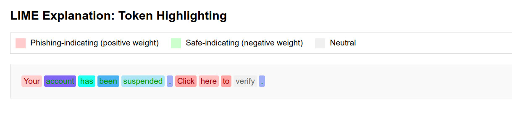
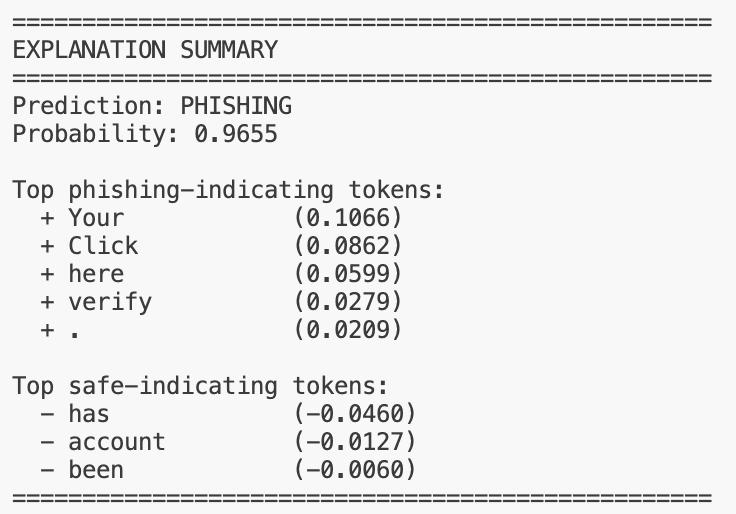

# Explaining phishing email detection with LIME and DistilRoBERTa

Phishing detection is a strong use case for explainable AI. 
In security systems, it is not enough to say that an email is phishing.
Analysts, administrators, and even end users often need to know why the model made that decision.

In this paper we apply explainable AI to phishing email detection. 
We train a transformer-based classifier using DistilRoBERTa, and then explain individual predictions using LIME.


### Why XAI matters for phishing detection
Some points are:
- false negatives can allow malicious emails into inboxes
- false positives can block legitimate communication
- explanations help analysts understand model behavior and debug failure cases
- need foor interpretable evidence to trust model outputs

Transformer models are powerful, but they are difficult to interpret directly. 
LIME gives a practical way to explain a single prediction without changing the classifier itself.

## Problem setup

Our task is binary classification:

- class `1`: phishing
- class `0`: safe

We use a phishing email dataset with about 18.6k labeled emails. 
The classifier is a fine-tuned `distilroberta-base` model for sequence classification.

The full pipeline is:

1. load and normalize the dataset
2. split into train, validation, and test sets
3. fine-tune DistilRoBERTa
4. build a prediction function returning phishing probabilities
5. run LIME on individual emails
6. validate explanations


## Model training pipeline

### Data loading and normalization

The dataset loader resolves text and label columns and converts labels into a standard binary form.

A simplified view of the logic:

```python
def _normalize_label(raw_label):
    value = str(raw_label).strip().lower()

    if any(token in value for token in ("phish", "spam", "malicious")):
        return 1
    if any(token in value for token in ("safe", "legit", "ham", "benign")):
        return 0
```

The train/validation/test split is stratified(same labels proportions),
which is important for maintaining label proportions across splits.

'''python
train_df, val_df, test_df = stratified_split(
    df, val_size=0.1, test_size=0.1, seed=42
)
'''

### Fine-tuning DistilRoBERTa

The model is loaded using Hugging Face Transformers:

'''python
tokenizer, model = build_tokenizer_and_model("distilroberta-base")
'''

The training script tokenizes text, pads dynamically, and uses standard classification metrics:

- accuracy
- precision
- recall
- F1-score

The prediction probability for the phishing class is computed from the softmax output.

This probability function is suitable for LIME, because LIME treats the classifier as a black box: 
it does not care which type of the model is used. It only needs a function that maps text inputs to predictions.


## What is LIME?

LIME stands for **Locally Interpretable Model-Agnostic Explanations**.

The main idea is simple:
To explain one prediction, create many small perturbations around the original input, observe how the model behaves on those perturbations, 
and fit a simple interpretable model locally.

For text classification, the interpretable units are usually words or tokens.

For one email, LIME does the following:

1. split the email into words
2. create many perturbed versions by removing subsets of words
3. run the classifier on these perturbed texts
4. weight perturbed samples by how similar they are to the original email
5. fit a simple linear surrogate model
6. use the surrogate coefficients as token importance scores

The standard LIME objective is:

$ξ(x) = \arg\min_{g \in G} L(f, g, π_x) + Ω(g)$

where:

- f is the black-box model
- g is the interpretable surrogate model
- $π_x$ is the locality kernel
- L measures local approximation error
- Ω(g) penalizes complexity

In practice, we approximate this with weighted linear regression.

## LIME implementation

### Tokenization into interpretable units

LIME needs an interpretable representation. For text, we use words and punctuation as tokens.

```python
def tokenize_words(self, text: str):
    return re.findall(r"\w+|[^\w\s]", text, flags=re.UNICODE)
```

This regex keeps both words and punctuation, which is useful because phishing emails often contain:

- exclamation marks
- URLs
- suspicious punctuation patterns
- all-caps urgency markers

For example, the email:

```text
IMPORTANT: Your account has been suspended. Click here now!
```
### Generating perturbations

Each perturbed sample is represented as a binary mask over the token list.

- `1` means keep the token
- `0` means remove the token

In our implementation we generate masks with Bernoulli sampling:

```python
mask = np.random.binomial(1, 0.5, size=n_tokens)
```

So if the original token list has length `n`, each perturbation is a vector of length `n`.

Example:

Original tokens:

```text
["verify", "your", "account", "now"]
```

Possible mask:

```text
[1, 0, 1, 0]
```

Perturbed text:

```text
verify account
```

This creates a local neighborhood around the original email.

### Applying perturbations

To convert a mask back into text:

```python
def _apply_perturbation(self, tokens, mask):
    kept_tokens = [token for token, keep in zip(tokens, mask) if keep == 1]
    return " ".join(kept_tokens)
```

It does slightly alter text fluency, but LIME does not require grammatical perturbations. 
It only needs enough local variation to estimate feature influence.

### Computing locality weights

Not all perturbations should matter equally.

A perturbation that removes one or two words is much closer to the original email than one that 
removes most of the content. LIME assigns higher weights to nearby perturbations.

We compute Hamming distance from the original all-ones mask:

```python
distance = np.sum(1 - mask)
```

and then uses an exponential kernel:

```python
weights = np.exp(-(distances ** 2) / (self.kernel_width ** 2))
```

So perturbations with fewer removed tokens receive larger weights.

### Querying the classifier

Once we create perturbed texts, we call the phishing classifier on all of them.

The prediction function returns the phishing probability.

Now each perturbation has:

- a binary feature vector
- a locality weight
- a target value: phishing probability

This is the training data for the local surrogate model.

### Fitting the surrogate model

For this we use weighted ridge regression.
This gives a coefficient for each token position.

Note:
- positive coefficient: keeping the token increases phishing probability
- negative coefficient: keeping the token decreases phishing probability
- larger magnitude: stronger local influence


## Example






## Evaluating explanation with deletion test

The problem is that explanations may look good without actually reflecting model behavior.

So we included deletion test.
If LIME correctly identifies the most important phishing-driving tokens, then removing those tokens should cause the phishing probability to drop quickly.
If we instead remove random tokens, the probability should usually drop more slowly.

So the evaluation process is:

1. rank tokens by importance
2. progressively remove the top-ranked tokens
3. measure model probability after each removal step
4. compare against random deletion

A better explanation produces a steeper probability drop.

## Limitations

### Perturbations can create unnatural text

Removing words arbitrarily may create broken sentences that are unlikely in real email data. 
The classifier may behave differently on these out-of-distribution perturbations.

### Correlated features are hard to separate

Words such as `verify`, `account`, and `identity` often appear together in phishing emails. 

A linear model may distribute importance across them imperfectly.

## References
We inspired by [paper](https://www.sciencedirect.com/science/article/pii/S1389128626000733) "An explainable transformer-based model for phishing email detection: A large language model approach" 2026.
